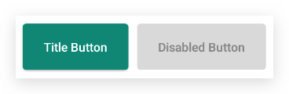
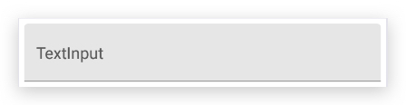

## material-js

⛱ A UI framework for React Native based on [Material Design](https://material.io).

### Get Start

```javascript
// index.js
import * as React from 'react';
import { AppRegistry } from 'react-native';
import App from './App';
import { ThemeProvider, LightTheme } from 'material-js';
class Main extends React.Component {
    render() {
        return (
            <ThemeProvider theme={LightTheme}>
                <App />
            </ThemeProvider>
        );
    }
}
AppRegistry.registerComponent('ui0493', () => App);
```

### 核心思想

贴近现实、简洁直观、物理材质、纯净过渡

### 主要特征

material-js借鉴了Material Design的设计思路，在材质、空间、动画、色彩、图标等方面，有别于其他样式库。

#### 材质

视图材质近似于液体：

- 支持层叠、合并、分离
- 拥有惯性及波纹反馈

#### 空间

视图存在于三维空间中，拥有1dp厚度及可变的海拔高度，基于海拔高度产生视图投影，海拔越高，投影越重。

#### 动画

- 视图的动画具有惯性，与机械的匀速运动不同，在动画的始末都有加速和减速过程
- 用户的交互操作，通过水波反馈展示
- 子页面切换到父页面，需要先抬升子页面海拔高度，然后拓展至全屏幕
- 多个相似元素的动画需要按先后顺序展示
- 相似的运动需要符合统一规律

#### 色彩

色彩包含`主色primary`、`辅助色accent`(非必需)、黑色、白色四种，在此基础上进行透明度、饱和度变化，构成配色方案：

- Appbar背景使用主色，状态栏使用深一级主色
- 小面积且需高亮处使用辅助色
- 黑色：[87% 普通文字] [54% 减淡文字] [26% 禁用状态/提示文字] [12% 分隔线]
- 白色：[100% 普通文字] [70% 减淡文字] [30% 禁用状态/提示文字] [12% 分隔线]

#### 图标

使用[Material Design](https://material.io/tools/icons/)默认图标

------

## 展示样例

- [Appbar](#Appbar)
- [Button](Button)
- [Checkbox](#Checkbox)
- [List](#List)
- [Surface](#Surface)
- [Text](#Text)
- [TextInput](#TextInput)
- [Icon](#Icon)
- [PopupWindow](#PopupWindow)
- [DraggableGridView](#DraggableGridView)

### Appbar

导航栏通常由`标题`及分布于左右的`图标按钮`组成。

#### 普通导航栏


#### 大导航栏

大导航栏是普通导航栏的一种扩展，相比普通导航栏，能够展示更多的内容，它支持设置`背景图`和自定义的`扩展内容`。


#### 滚动导航栏

滚动导航栏是大导航栏的一种扩展，除了可以设置背景图和自定义的扩展内容之外，还提供了标题动画接口和自定义内容动画接口，可以自由设定`带动画效果的标题和自定义内容`。


### Button

按钮通常具有可用和不可用两种不同的形态，点击即触发`水波纹动画`。

#### 文字按钮

点击文字按钮除了会触发水波纹动画外，还会`抬升`按钮，释放点击操作后恢复。



#### 图标按钮

图标按钮支持配置Animated和anotherIcon属性，配置后点击按钮会触发`图标变换`动画。


#### FAB

FAB支持`纯图标形态`和`图标+文字形态`，点击触发水波纹。和文字按钮不同的是，它的高度高于本页面内任何控件（遮罩控件除外），因此它没有`点击抬升`动画。


#### 自定义按钮

当然，你也可以自定义按钮内容。


#### 动态效果


### Checkbox

同按钮一样，复选框也具有可用和不可用两种不同的形态。

此外，它支持checked/unchecked/indeterminate`三种复选状态`的展示。


### List

列表内容通常由一个或多个`Section`组成。

#### Section

顾名思义，Section是列表的组成部分，用于将相似或相关的其他列表部件有机地组合在一起。

每个部分可以有一个`标题`（如下面展示图中的"Subheader"）和若干个`Accordion`或`Item`。

#### Accordion

手风琴控件，可以自由展开的特殊列表项，支持配置`标题`、`描述`、`左侧显示布局`，它的子节点通常是Item。

#### Item

普通列表项，列表中最小的完整展示单元，支持配置`标题`、`描述`、`左侧显示布局`、`右侧显示布局`、`点击事件`。

#### Icon

专门用于列表的图标控件，通常作为其他列表部件的`左/右侧显示视图`

#### 动态效果


### Surface

整个控件库最基础也是最核心的控件，也是最能体现Material Design设计精髓的控件。

在控件库中，大部分控件（比如Button）都是基于Surface开发。

它具有海拔高度和物理阴影，可以容纳自定义布局。

#### 简单的Surface


#### 复杂的Surface


### Text

文字控件，采用sans-serif字体。


### TextInput

输入框，根据可编辑性、是否获取焦点、是否支持多行输入等特点可分为不同形态。

支持配置提示内容，提供获取焦点、丢弃焦点以及是否获取焦点判断方法。

#### 获取焦点


#### 丢失焦点



#### 不可编辑


#### 动态效果


### Icon

图标，主要用于展示Material图标。


更多图标请移步[此处](https://material.io/resources/icons/?style=baseline)

### PopupWindow

弹出式界面，通常由两部分组成：

#### Menu

弹出式菜单，可包裹多个Item。

#### Item

弹出式菜单项。

#### 动态效果


### DraggableGridView

网格布局，其子项可自由拖拽。

